# attentive-gan-derainnet
Use tensorflow to implement a Deep Convolution Generative Adversarial Network for image derain 
task mainly based on the CVPR2018 paper "Attentive Generative Adversarial Network for Raindrop 
Removal from A Single Image".You can refer to their paper for details https://arxiv.org/abs/1711.10098. 
This model consists of a attentive attentive-recurrent network, a contextual autoencoder 
network and a discriminative network. Using convolution lstm unit to generate attention map 
which is used to help locating the rain drop, multi-scale losses and a perceptual loss to 
train the context autoencoder network. Thanks for the origin author [Rui Qian](https://github.com/rui1996)

The main network architecture is as follows:

`Network Architecture`
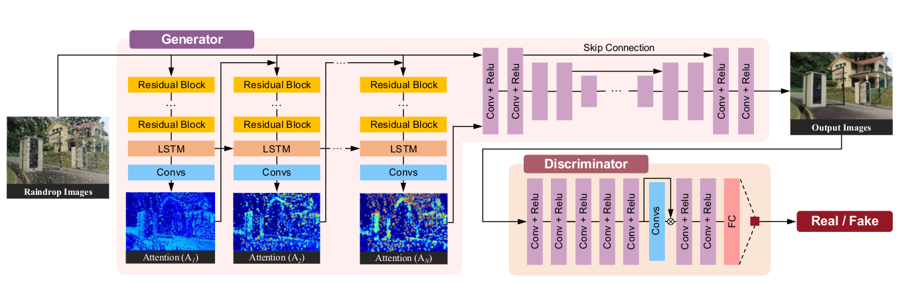

## Online demo

#### URL: https://maybeshewill-cv.github.io/attentive_derain_net

## Installation
This software has only been tested on ubuntu 16.04(x64), python3.5, cuda-9.0, cudnn-7.0 with 
a GTX-1070 GPU. To install this software you need tensorflow 1.15.0 and other version of 
tensorflow has not been tested but I think it will be able to work properly in 
tensorflow above version 1.10. Other required package you may install them by

```
pip3 install -r requirements.txt
```

## Test model
In this repo I uploaded a model trained on dataset provided by the origin author 
[origin_dataset](https://drive.google.com/open?id=1e7R76s6vwUJxILOcAsthgDLPSnOrQ49K).

The trained derain net model weights files are stored in folder weights/

You can test a single image on the trained model as follows

```
cd REPO_ROOT_DIR
python tools/test_model.py --weights_path ./weights/derain_gan/derain_gan.ckpt-100000
--image_path ./data/test_data/test_1.png
```

The results are as follows:

`Test Input Image`

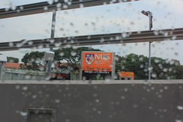

`Test Derain result image`

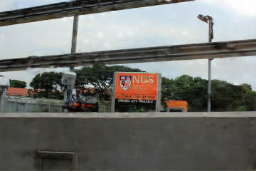

`Test Attention Map at time 1`

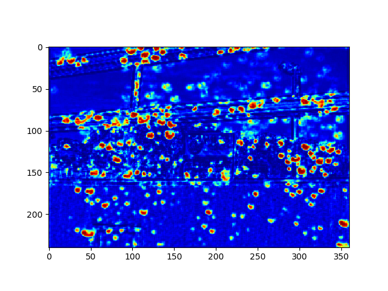

`Test Attention Map at time 2`


`Test Attention Map at time 3`

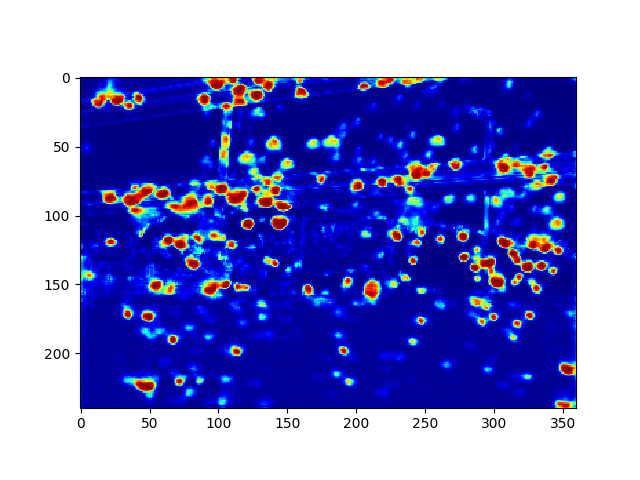

`Test Attention Map at time 4`

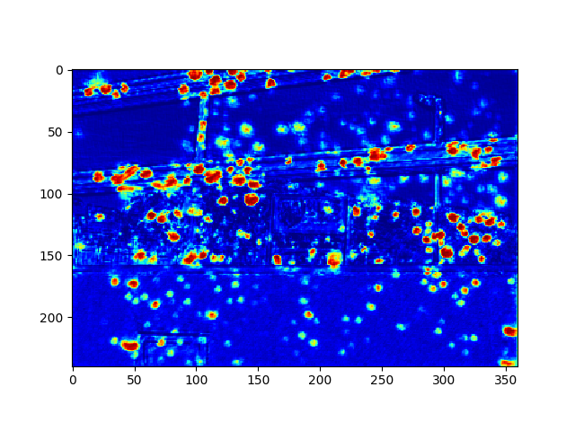

## Train your own model

#### Data Preparation
You need to organize your training examples. Put all of your rain images and
clean images in two separate folders which are named after 
SOURCE_DATA_ROOT_DIR/rain_image and SOURCE_DATA_ROOT_DIR/clean_image.
The rest of the preparation work will be done by running following script

```
cd PROJECT_ROOT_DIR
python data_provider/data_feed_pipline.py --dataset_dir SOURCE_DATA_ROOT_DIR
--tfrecords_dir TFRECORDS_SAVE_DIR
```

The training samples are consist of two components. A clean image free 
from rain drop label image and a origin image degraded by raindrops.

All your training image will be automatically scaled into the same scale 
according to the config file and will be converted into tensorflow records
for efficient data feed pipline.

#### Train model
In my experiment the training epochs are 100010, batch size is 1, initialized learning rate 
is 0.002. About training parameters you can check the global_configuration/config.py for 
details.
 
You may call the following script to train your own model

```
cd REPO_ROOT_DIR
python tools/train_model.py --dataset_dir SOURCE_DATA_ROOT_DIR
```

You can also continue the training process from the snapshot by
```
cd REPO_ROOT_DIR
python tools/train_model.py --dataset_dir SOURCE_DATA_ROOT_DIR 
--weights_path path/to/your/last/checkpoint
```

You may monitor the training process using tensorboard tools

During my experiment the `G loss` drops as follows:  
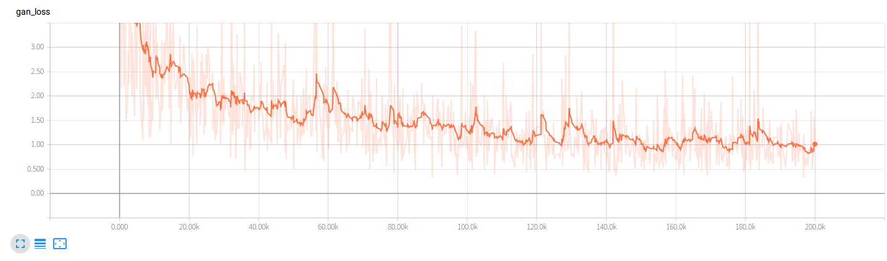

The `D loss` drops as follows:  
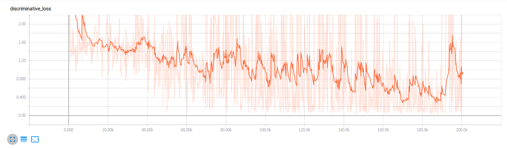

The `Image SSIM between generated image and clean label image` raises as follows:  
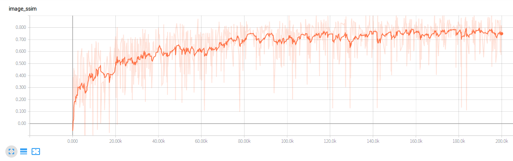

Please cite my repo [attentive-gan-derainnet](https://github.com/MaybeShewill-CV/attentive-gan-derainnet) 
if you find it helps you.

#### Export Model
The trained model can be convert into tensorflow saved model and tensorflow js
model for web useage. If you want to convert the ckpt model into tensorflow 
saved model you may run following script

```
cd PROJECT_ROOT_DIR
python tools/export_tf_saved_model.py --export_dir ./weights/derain_gan_saved_model 
--ckpt_path ./weights/derain_gan/derain_gan.ckpt-100000
```

If you want to convert into tensorflow js model you can modified the bash 
script and run it 

```
cd PROJECT_ROOT_DIR
bash tools/convert_tfjs_model.sh
```

## Common Issue
Several users find out the nan loss problem may occasionally happen in
training process under tensorflow v1.3.0. I think it may be caused by the randomly parameter 
initialization problem. My solution is to kill the training process and
restart it again to find a suitable initialized parameters. At the 
mean time I have found out that if you use the model under tensorflow
v1.10.0 the nan loss problem will not happen. The reason may be the
difference of parameter initialization function or the loss optimizer
function between older tensorflow and newest tensorflow. If the nan 
loss problem still troubles you when training the model then upgrading 
your local tensorflow may be a nice option. Good luck on training process!

Thanks for the issues by [Jay-Jia](https://github.com/Jay-Jia)

## Update on 2018.10.12
Adjust the initialized learning rate and using exponential decay
strategy to adjust the learning rate during training process. Using
traditional image augmentation function including random crop and 
random flip to augment the training dataset which protomed the new
model performance. I have uploaded a new tensorboard record file and
you can check the image ssim to compare the two models. New
model weights can be found under weights/new_model folder.

`Model result comparison`
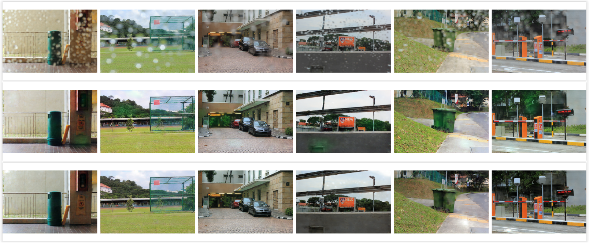

The first row is the source test image in folder ./data/test_data, the
second row is the derain result generated by the old model and the last
row is the derain result generated by the new model. As you can see the
new model can recover more vivid details than the old model and I will 
upload a figure of ssim and psnr which will illustrate the new model's
promotion.

## Update on 2018.11.3
Since the batch size is 1 during the training process so the batch
normalization layer seems to be useless. All the bn layers were removed
after the new updates. I have trained a new model based on the newest 
code and the new model will be placed in folder root_dir/weights/new_model
and the model updated on 2018.10.12 will be placed in folder 
root_dir/weights/old_model. The new model can present more vivid details
compared with the old model. The model's comparison result can be seen
as follows.

`Model result comparision`
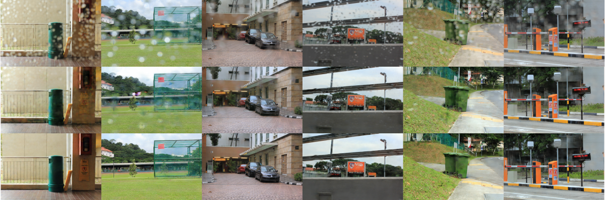

The first row is the source test image in folder ./data/test_data, the
second row is the derain result generated by the old model and the last
row is the derain result generated by the new model. As you can see the
new model perform much better than the old model.

Since the bn layer will leads to a unstable result the deeper attention 
map of the old model will not catch valid information which is supposed
to guide the model to focus on the rain drop. The attention map's 
comparision result can be seen as follows.

`Model attention map result comparision`
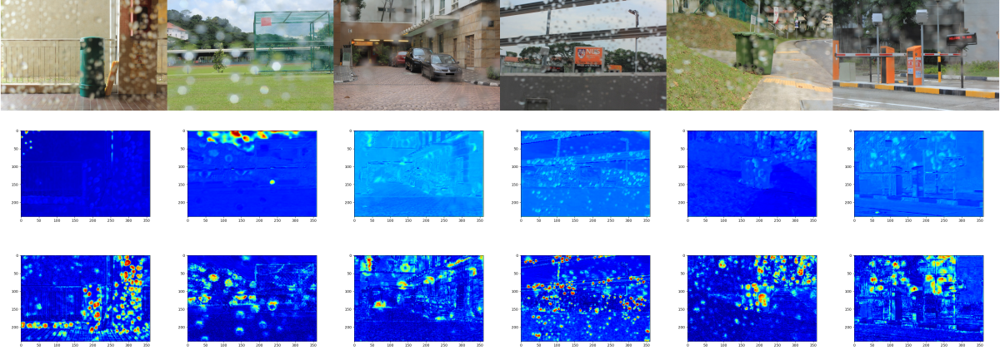

The first row is the source test image in folder ./data/test_data, the
second row is the attention map 4 generated by the old model and the 
last row is the attention map 4 generated by the new model. As you can 
see the new model catch much more valid attention information than the
old model.

## TODO
- [x] Parameter adjustment
- [x] Test different loss function design
- [ ] Add tensorflow service
